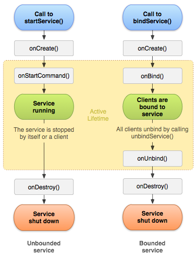

## 知道Service吗

Service 是一个专门在后台处理长时间任务的 Android 组件, 没有UI.

## 它有几种启动方式

有两种启动方式:

* startService
* bindService

## 什么区别

* **startService** 只是启动服务, 启动它的组件（如 Activity）和服务并没有关联, 只有当服务调用 `stopSelf()` 或者其他组件调用 `stopService()` 时服务才会终止.

* **bindService** 方法启动服务, 其它组件可以通过回调获取服务的代理对象**和服务交互**, 而这两方也进行了**绑定**, 当启动方销毁时, 服务也会自动进行 `unBind` 操作, 当发现所有绑定都进行了 `unBind` 时才会销毁服务.

## 2 种调用对 Service 生命周期的影响

如果是非绑定模式, Service 会经历 onCreate 到 onStartCommand, 然后处于运行状态，当调用者调用 `stopService()` 或者服务本身调用 `stopSelf()` 的时候调用 onDestroy. **如果是调用者自己直接退出而没有调用 stopService 的话, Service 会一直在后台运行.**

但是如果是绑定模式, 一个 Service 可以被多个客户进行绑定, 只有所有的绑定对象都执行了`onUnbind()` 方法后该服务才回销毁.

我们在开发的过程中还必须注意 **Service 实例只会有一个**, 也就是说如果当前要启动的 Service 已经存在了那么就不会再创建该 Service 当然也就不会调用 `onCreate()`.

## Service 能否在主线程中执行?

可以. Service 本身就是在主线程中调用的.

## onCreate 回调可以做耗时操作吗? / Service 能否进行耗时操作?

不可以. onCreate 是在主线程中调用的，耗时操作会阻塞UI.

## 如果要做耗时操作呢?

除了直接使用一些异步操作如 Handler 之外创建新的线程. 你可以直接使用 IntentService

IntentService 是用来处理异步 (asynchronous) 请求的 Service 的子类. 它是通过创建一个独立的工作者线程 (worker thread) 来完成工作. 并且在完成工作后自动关闭服务. 

通常的 Service 是用于无需 UI 的任务. 但是不能执行耗时任务. 不然的话需要创建额外的线程来执行任务. 所以就有了 IntentService. 它主要被用于处理耗时任务的服务, 自身内部会自动创建一个额外的线程来执行任务. 

总结:

* 它本质是一种特殊的 Service, 继承自 Service 并且本身就是一个抽象类
* 它可以用于在后台执行耗时的异步任务, 当任务完成后会自动停止
* 它内部通过 HandlerThread 和 Handler 实现异步操作
* 创建 IntentService 时，只需实现 onHandleIntent 和构造方法，onHandleIntent 为异步方法，可以执行耗时操作

## Activity 怎么和 Service 绑定?

Activity 通过 `bindService(Intent service, ServiceConnection conn, int flags)` 跟服务进行绑定, 当绑定成功的时候服务会将代理对象通过  `onBind()` 方法传给 conn, 这样我们就拿到了服务提供的服务代理对象.

## 如果一个应用要从网络上下载MP3文件, 并在Activity上展示进度条, 这个Activity要求是可以转屏的. 那么在转屏时Actvitiy会重启, 如何保证下载的进度条能正确展示进度呢?
